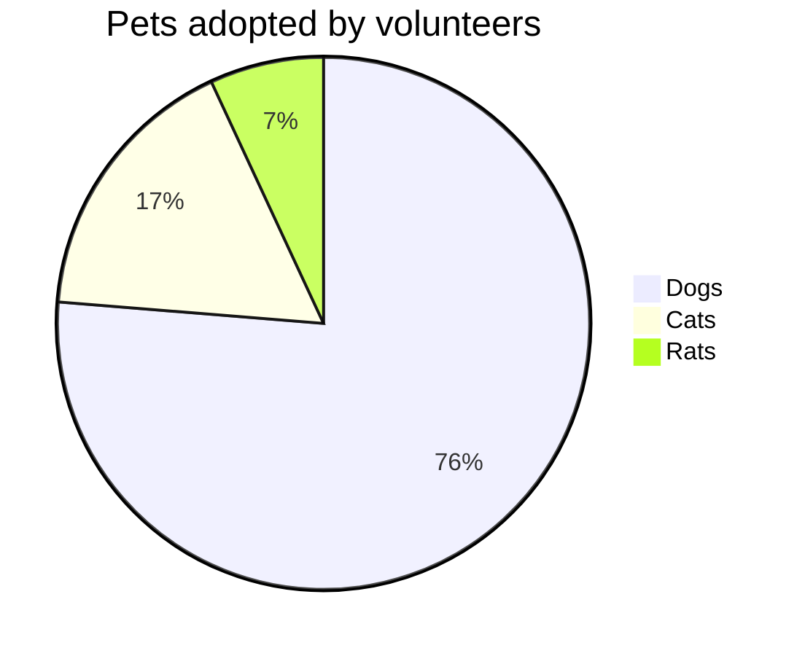
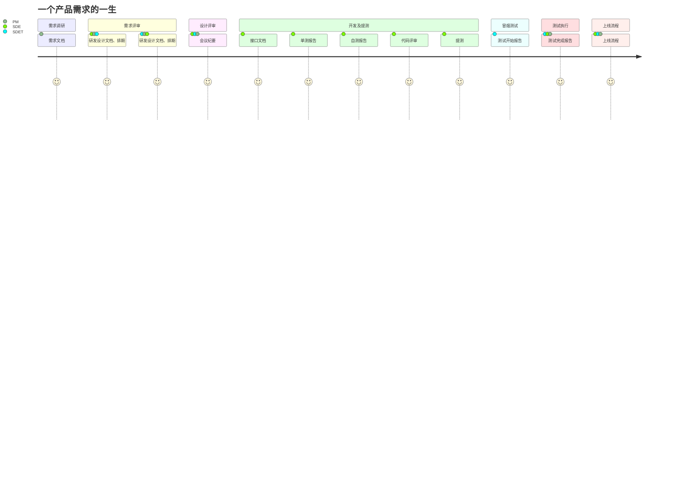

<input type="button" value="今天去哪吃" onclick="where2eat()">

<table align="center">
<tr>
<td class="td_orange" colspan="5" id="content"></td>
</tr>
<tr>
<td class="td_orange" colspan="5" id="result"></td>
</tr>
<tr>
<td onclick="appContent(this)">1</td>
<td onclick="appContent(this)">2</td>
<td onclick="appContent(this)">3</td>
<td onclick="appContent(this)">*</td>
<td onclick="appContent(this)">/</td>
</tr>
<tr>
<td onclick="appContent(this)">4</td>
<td onclick="appContent(this)">5</td>
<td onclick="appContent(this)">6</td>
<td onclick="appContent(this)">+</td>
<td onclick="appContent(this)">-</td>
</tr>
<tr>
<td onclick="appContent(this)">7</td>
<td onclick="appContent(this)">8</td>
<td onclick="appContent(this)">9</td>
<td onclick="appContent(this)">(</td>
<td onclick="appContent(this)">)</td>
</tr>
<tr>
<td class="td_orange" onclick="appContent(this)">c</td>
<td onclick="appContent(this)">0</td>
<td onclick="appContent(this)">.</td>
<td onclick="appContent(this)">del</td>
<td class="td_orange" onclick="appContent(this)">=</td>
</tr>
</table>

请输入原数字串：<input type="text" id="sendpay" onblur="checkSendpay()"/>

    将第<input type="text" id="loc" onblur="checkLoc(this);"/>位的值，替换为<input type="text" id="newVal" onblur="checkNewVal()"/>（位数从0开始数）
    <input type="button" value="替换" onclick="replace()">
    
替换后的结果为：

    <pan id="result"></pan>

    获取第<input type="text" id="getLoc"  onblur="checkLoc(this);"/>位的值（位数从0开始数）<input type="button" value="获取" onclick="getNum()">

    版本信息：
    Ver0.4：去掉了异常输入校验，增加了对chrome的兼容性。

